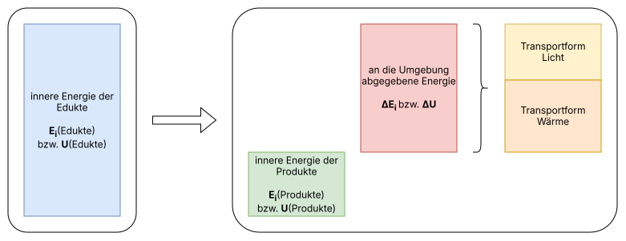
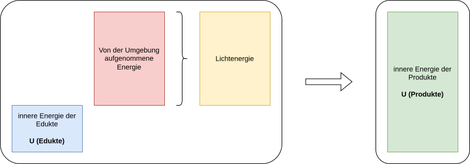

<!--
author:   KREM

email:    your@mail.org

version:  0.0.1

language: de

narrator: Deutsch Female

comment:  Kursskript Chemie Oberstufe
          Grundlegendes Anforderungsniveau - Sachsen-Anhalt
-->

# Chemie gAn

## Sicherheitsbelehrung

### Die Gefahrenpiktogramme


- [[] [] [] [] [] [] [] [] []]
- [    ( )           ( )             ( )             ( )             (x)             ( )             ( )             ( )             ( )     ]  Ätzend
- [    ( )           ( )             ( )             ( )             ( )             ( )             ( )             ( )             (x)     ]  Umweltgefährdend
- [    ( )           ( )             ( )             ( )             ( )             (x)             ( )             ( )             ( )     ]  Giftig
- [    ( )           (x)             ( )             ( )             ( )             ( )             ( )             ( )             ( )     ]  Leichtentzündlich
- [    ( )           ( )             ( )             ( )             ( )             ( )             (x)             ( )             ( )     ]  Gesundheitsschädlich
- [    ( )           ( )             ( )             ( )             ( )             ( )             ( )             (x)             ( )     ]  Gesundheitsgefährdend
- [    ( )           ( )             (x)             ( )             ( )             ( )             ( )             ( )             ( )     ]  Brandfördernd
- [    (x)           ( )             ( )             ( )             ( )             ( )             ( )             ( )             ( )     ]  Explosionsgefährlich
- [    ( )           ( )             ( )             (x)             ( )             ( )             ( )             ( )             ( )     ]  Gas unter Druck

### Die H- und P-Sätze

Das „H” in den H-Sätzen steht für [[ help | Hilfe | (hazard) ]]. Diese Sätze beschreiben die [[ (Gefahren) | Eigenschaften | Reaktionen ]] von einem bestimmten Stoff. 
Jeder H-Satz besteht aus einer [[ (dreistelligen) | einstelligen | einstelligen ]] Nummer. Seine Bedeutung kannst du im Schulbuch nachlesen. Das „P“ in den P-Sätzen steht
für [[ person | (precaution) | pollution ]]. Die P-Sätze beschreiben die[[ Personen, die mit diesen Stoffen arbeiten dürfen | richtige Abfallentsorgung der Stoffe | (Sicherheitshinweise bei der Handhabung und Unfällen) ]].
Bei den P-Sätzen ist die Nummer [[ zweistellig | einstellig | (dreistellig) ]]. Sätze können durch ein Plus-Symbol (+) miteinander verknüpft werden.

Recherchiere die Bedeutung folgender Sätze:
---

H226: [[Flüssigkeit und Dampf entzündbar]].

H310: [[Lebensgefahr bei Hautkontakt]].

P304+340: [[BEI EINATMEN: An die frische Luft bringen und in einer Position ruhig stellen, die das Atmen erleichtert.]]

## Fundamente und Checkpoints

Je besser du die fachlichen Grundlagen beherrschst und je mehr Vorwissen (z. B. „warum ist das wichtig zu wissen? Was hat das mit meinem Leben konkret zu tun?“) du mitbringst, desto einfacher wird es dir fallen, dir neue Fachinhalte anzueignen und neue Kompetenzen zu entwickeln.

Am Anfang eines Kapitels findest du eine Übersicht, mit der du dein Verständnis der fachlichen Grundlagen überprüfen kannst. Diese folgt dem Schema:

* Kernidee: eine kurze Beschreibung eines wesentlichen Fachinhalts
* Erwartungen: was du erklären können solltest
* Fehlvorstellungen: welche falschen Annahmen weit verbreitet sind

> [!CAUTION] 🛑 ACHTUNG
> * Setze dich gewissenhaft mit der Liste auseinander
> * Hake nur ab, was du auch erklären kannst
> * Mache einen Screenshot der Liste und speichere das Bild in deinen Notizen
> * Mache Anmerkungen bei den nicht abgehakten Punkten (z. B. „Buch S. 137“ oder „Fachbegriff definieren“)
> * Erstelle dir einen **konkreten** Lernplan, um die Inhalte nachzuarbeiten.

## Energetik

### Die Bindungstypen


      {{1}}
****
Man unterscheidet in der Chemie drei Bindungsarten:
1. Die Metallbindung
2. Die Ionenbindung
3. Die Elektronenpaarbindung
****

      {{2}}
Um abzuschätzen, welche Bindung vorliegt, schaut man in das Periodensystem und ermittelt, ob es sich bei den beteiligten Atomsorten um Metalle oder Nichtmetalle handelt:

      {{3}}
- `Metall` + `Metall` => `Metallbindung`
- `Metall` + `Nichtmetall` => `Ionenbindung`
- `Nichtmetall` + `Nichtmetall` => `Elektronenpaarbindung`

#### 🏗️ Fundamente

> [!NOTE] 💭 Kernidee
> Atome bestehen aus Elementarteilchen, die unterschiedlich geladen sind.

*Du solltest wissen, dass …*

- [ ] Protonen, Neutronen und Elektronen die Bausteine der Atome sind.
- [ ] Protonen positiv geladen sind.
- [ ] Elektronen negativ geladen sind.
- [ ] Neutronen elektrisch neutral sind.
- [ ] die Ladung von Protonen und Elektronen gleich groß ist.

*Welche falschen Annahmen du nicht haben sollst:*

- [ ] ~Atome werden als massive Kugeln aufgefasst~
- [ ] ~Elementarteilchen werden mit Atomen gleichgesetzt~

---

> [!NOTE] 💭 Kernidee
> Protonen und Neutronen befinden sich im Atomkern und machen fast die gesamte Masse des Atoms aus, während sich die Elektronen in der aus leerem Raum bestehenden Atomhülle befinden und die Größe des Atoms bestimmen (Rutherford).

*Du solltest wissen, dass …*

- [ ] zwischen den Elementarteilchen eines Atoms Kräfte wirken.
- [ ] die Elektronen die Atomhülle bilden.
- [ ] die Protonen und Neutronen den Atomkern bilden.
- [ ] die Masse eines Atoms nahezu durch den Kern bestimmt wird.
- [ ] die Größe eines Atoms von der Atomhülle bestimmt wird.
- [ ] ein Atom überwiegend aus leerem Raum besteht.
- [ ] Protonen und Neutronen jeweils die Masse von einem u besitzen.

*Welche falschen Annahmen du nicht haben sollst:*

- [ ] ~In der Atomhülle befindet sich Luft.~
- [ ] ~Die Atomhülle besitzt eine materielle (sichtbare) Grenze.~

---

> [!NOTE] 💭 Kernidee
> Die Verteilung der Elektronen in der Atomhülle kann durch das Schalenmodell beschrieben werden.
*Du solltest wissen, dass …*

- [ ] sich die Elektronen in der Atomhülle nur in bestimmten Bereichen bewegen.
- [ ] Schalen gedachte Aufenthaltsbereiche für Elektronen sind.
- [ ] Elektronen die Schalen nach bestimmten Prinzipien besetzen (innerste Schale max. 2 Elektronen, äußere Schale max. 8 Elektronen).
- [ ] die Elektronen von innen nach außen aufgefüllt werden.
- [ ] eine vollbesetzte Außenschale der Edelgaskonfiguration entspricht.

*Welche falschen Annahmen du nicht haben sollst:*

- [ ] ~Schalen werden materiell (wie z. B. beim Zwiebelaufbauprinzip) verstanden.~

---

> [!NOTE] 💭 Kernidee
> Wenn Atome miteinander wechselwirken, geschieht dies über die Außenschale.
*Du solltest wissen, dass …*

- [ ] nur die Außenelektronen an der chemischen Reaktion beteiligt sind.
- [ ] Atome die Edelgaskonfiguration anstreben.
- [ ] Neutronen und Protonen für die chemische Reaktion keine Rolle spielen.

*Welche falschen Annahmen du nicht haben sollst:*

- [ ] ~Atome durchdringen sich bei chemischen Reaktionen vollständig.~

---

> [!NOTE] 💭 Kernidee
> Wenn Atome miteinander wechselwirken, geschieht dies über die Außenschale.
*Du solltest wissen, dass …*

- [ ] nur die Außenelektronen an der chemischen Reaktion beteiligt sind.
- [ ] Atome die Edelgaskonfiguration anstreben.
- [ ] Neutronen und Protonen für die chemische Reaktion keine Rolle spielen.

*Welche falschen Annahmen du nicht haben sollst:*

- [ ] ~Atome durchdringen sich bei chemischen Reaktionen vollständig.~

---

> [!NOTE] 💭 Kernidee
> Atome können unter Beteiligung von Außenelektronen Bindungen eingehen.
*Du solltest wissen, dass …*

- [ ] Atome durch Bindungen gruppiert werden.
- [ ] es unterschiedliche Bindungsarten gibt.
- [ ] die verschiedenen Bindungsarten auf unterschiedliche Art und Weise zustande kommen.

*Welche falschen Annahmen du nicht haben sollst:*

- [ ] ~Eine Bindung bildet sich durch Zusammenwachsen der Atome.~
- [ ] ~Durch Mischen entstehen Bindungen.~
- [ ] ~Stoffgemische und Verbindungen bezeichnen die selbe Sache.~

### Die Metallbindung
> [!NOTE] 💻 INTERAKTIVES MATERIAL
> [Die Metallbindung*](https://apps.zum.de/apps/38450)

#### Die Bindungspartner

Bei Metallen sind die Valenzelektronen nur schwach gebunden, d. h. der Atomkern zieht die Elektronen der äußeren Schale nur schwach an. Diese werden daher sehr einfach vom Atom getrennt und sind nun frei beweglich bzw. delokalisiert. Aus den Atomen entstehen die Atomrümpfe, also positiv geladene Kationen, die alle ihre ursprünglichen Valenzelektronen abgegeben haben.

#### Die Metallbindung

Die Atomrümpfe ordnen sich in einem regelmäßigen Gitter an. Die Valenzelektronen können sich relativ frei zwischen den Atomrümpfen bewegen und werden nun als Elektronengas bezeichnet. Die positiv geladenen Atonrümpfe ziehen die negativ geladenen Elektronen aufgrund der gegensätzlichen Ladung, also elektrostatischer Wechselwirkungen an. Weil die Anziehungskräfte in alle Raumrichtungen wiken, also ungerichtet sird, bildet sich eine Gitterstruktur aus.

#### Die Eigenschaften der Metalle


> [!TIP] 💡 BASISKONZEPT
> Das __„Konzept vom Aufbau und von den Eigenschaften der Stoffe und ihrer Teilchen“__ kann dir helfen. Es besagt, dass sich die Eigenschaften von Stoffen aus der Struktur der Teilchen der Stoffe ableiten lassen. Kennst du also den Aufbau auf der Teilchenebene, kannst du (ohne alles auswendig zu lernen) die Eigenschaften des Stoffs ziemlich gut vorhersagen.


__Folgende Eigenschaften zeigen Metalle__
1. Verformbarkeit
    > Metalle sind verformbar und biegsam. Das bedeutet, dass sie nicht brechen, wenn eine Kraft auf sie einwirkt. Durch die Krafteinwirkung werden die Schichten der Atomrümpfe 
2. Wärmeleitfähigkeit
3. Elektrische Leitfähigkeit
4. Metallischer Glanz

#### ✅ Checkpoint
> [!NOTE] 💭 Kernidee
> Aus der Bildung von Atomrümpfen und frei beweglichen Außenelektronen resultiert die metallische Bindung.

Du solltest wissen, dass …

- [ ] zwischen Metallatomen eine metallische Bindung ausgebildet wird.
- [ ] Metallatome ihre Außenelektronen "abgeben" und sich dadurch sogenannte "Atomrümpfe", bestehend aus dem Atomkern und den inliegenden Schalen, bilden.
- [ ] die abgegebenen Außenelektronen zwischen den Atomrümpfen frei beweglich sind.
- [ ] die metallische Bindung durch die Anziehung der entgegengesetzt geladenen Teilchen (Atomrümpfe und "freie" Elektronen) entsteht.


### Die Ionenbindung

### Die Elektronenpaarbindung

### Die Wechselwirkungen

### Chemische Reaktionen und Energie

#### Die Eigenschaften einer chemischen Reaktion

{{1-12}}
****
Chemische Reaktionen sind durch eine Stoffumwandlung gekennzeichnet, d. h. Edukte verschwinden und Reaktionsprodukte werden gebildet.

Dabei kommt es aber immer auch zu einem Energieumsatz. Wir untescheiden hierbei zwischen zwei Fällen:
****

{{2-12}}
****
Die exotherme Reaktion
====



Bei einer exothermen Reaktion haben die Reaktionsprodukte eine geringere innere Energie als die Edukte. Da der Energieerhaltungssatz gilt, muss die Energiedifferenz in andere Energieformen umgewandelt und damit abgegeben worden sein.
****

{{3-12}}
****
> [!NOTE] BEISPIEL
> Die Kohlen eines Holzkohlegrills werden angezündet und die Luftzufuhr des Grills geöffnet. Es findet eine vollständige Verbrennung (idealisiert) statt:
>
> $\ce{C + O2 -> CO2}$
>
> Die Differenz der inneren Energie zwischen Kohlenstoff und Sauerstoff auf der einen und Kohlerstoffdioxid auf der anderen Seite, wird als Wärmeenergie (Temperaturerhöhung im Grill) und Lichtenergie (Glühen der Kohlen) abgegeben.
****

{{4-12}}
****
Im Chemieunterricht stellen wir das schematisch als [`Energiediagramm`](#Glossar) dar.
``` ascii
E ^
  |
  |     "{{5-12}} $\ce{C + O2}$"
  |- - ---------------
  |                  |
  |                  |
  |                  | "{{7-12}} ΔE < 0"
  |                  |
  |                  |
  |                  v  "{{6-12}} $\ce{CO2}$"
  |- - - - - - - ---------------
  |
```
****

{{8-12}}
****
Wollen wir nicht nur den energetischen Zustand vor und nach der Reaktion, also „Start“ und „Ziel“ betrachten, ergänzen wir auf einer zweiten Achse den Reaktionsverlauf. Damit sehen wir nun auch die Entwicklung der inneren Energie und damit „den energetischen Weg“. Wir erhalten ein so genanntes [`Energieverlaufsdiagramm`](#Glossar) (hier sind zur Vereinfachung __E__{dukte} und __P__(rodukte) statt der chemischen Formeln eingetragen; sind diese bekannt, werden sie auch eingetragen!). Neben der Änderung der inneren Energie $ΔE$ wird hier auch die [`Aktivierungsenergie`](#Glossar) $E_{A}$ dargestellt.
``` ascii
E ^
  |
  |         .-. - - - - - - - - - ^ -
  |    E   /   \                  | "E<sub>A</sub>"
  | ------'     \ - - - - - - - - - -
  |              \                |
  |               \               |"ΔE < 0"
  |                \    P         |
  |                 '------ - - - v -
  |
  |
  +------------------------------------------------>
                                  Reaktionsverlauf
```
****
{{9-12}}
****
Die endotherme Reaktion
===



Bei einer endothermen Reaktion haben die Reaktionsprodukte eine höhere innere Energie als die Edukte. Da der Energieerhaltungssatz gilt, muss die Energiedifferenz während der Reaktion von der Umgebung aufgenommen worden sein.
****

{{10-12}}
****
> [!NOTE] BEISPIEL
> Lichtstrahlen der Sonne scheinen auf ein Blatt einer Pflanze. In den Chloroplasten der Pflanze findet Fotosynthese statt, also die Umwandlung von Kohlenstoffdioxid und Wasser in Glucose und Sauerstoff mit Hilfe der Energie des Sonnenlichts:
>
> $\ce{6 CO2 + 6 H2O -> C6H12O6 + 6 O2}$
>
> Die Differenz der inneren Energie zwischen Kohlenstoffdioxid und Wasser auf der einen und Glucose und Sauerstoff auf der anderen Seite, wird als Lichtenergie aufgenommen. Wir sehen nicht, dass Lichtenergie bei dieser Reaktion aufgenommen wird, aber wir können darauf schließen, da die Fotosynthesereaktion bei Nacht stoppt.
****

{{11-12}}
****
Stellen wir nun auch die Fotosynthesereaktion im Energiediagramm dar:
``` ascii
E ^
  |
  |              "$\ce{C6H12O6 + 6 O2}$"
  |- - - - - - - --------------------
  |                                ^
  |                                |
  |                                | "ΔE > 0"
  |                                |
  |                                |
  |   "$\ce{6 CO2 + 6 H2O}$"       |
  |- - ------------------------------
  |
```

Und als Energieverlaufsdiagramm:

``` ascii
E ^
  |                                
  |             .-. - - - -  - - ^- -
  |            /   \             | "E<sub>A</sub>"
  |           /     '------ - - -|-^- 
  |          /                   | |
  |         /                    | | "ΔE > 0"
  |        /                     | |
  | ------' - - - - - - - - - - - - - 
  |
  |
  +------------------------------------------------>
                                  Reaktionsverlauf
```
****

{{12}}
****
Fassen wir zusammen:

Bei chemischen Reaktionen werden aus Edukten (Reaktions-)Produkte. Dies bezeichnet man als [[Stoffumwandlung]]. Gleichzeitig spielt auch immer die Übertragung von [[Energie]] eine Rolle. Reaktionen, bei denen Energie an die Umgebung abgegeben wird, bezeichnet man als [[exotherm]]. Bei [[endothermen]] Reaktionen wird hingegen Energie aus der Umgebung aufgenommen. Die [[Differenz]] der inneren Energie kann mit einem [[Energiediagramm]] dargestellt werden. Möchte man auch die Entwicklung der inneren Energie während der Reaktion darstellen, benötigt man ein [[Energieverlaufsdiagramm]].
****

#### Die Reaktion als System

### Die Reaktionswärme

### Die Enthalpie

### Der Satz von Hess

### 🥼 Kalorimetrie

## Glossar

| Begriff | Erklärung |
| :-----: | :-------- |
| Energiediagramm | Ein Diagramm, das den relativen Bezug zwischen innerer Energie der Edukte und innerer Energie der Produkte dargestellt. |
| Energieverlaufsdiagramm | Ein Diagramm, das die Entwicklung der inneren Energie des Systems in Abhängigkeit vom Reaktionsverlauf darstellt. |


